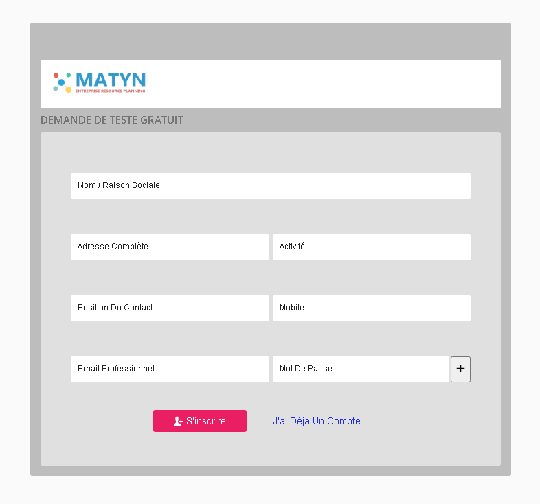

# Guide
> En cours d'édition

## Teste gratuit
Pour suivre et pratiquer les méthodes exposées dans cet documentation, vous devez activer un compte de teste gratuitement en ligne dont voici les étapes à suivre : 
* Connectez vous à la page suivante : [Matyn Erp](https://matyn-erp.web.app).
* Cliquez sur **créer un nouveau compte**
* Remplisser les champs par les données de votre entreprise.
* Une fois c'est terminé, cliquer sur le boutton **s'inscrire** et n'oublier pas de  noter le message en haut pour voir l'état de votre inscription.

> Désormé vous ne pouvez pas vous connecter à votre compte j'ausqu'à ce qu'il soit activer par l'adminitstrateur, une fois ceci est fait, un email vous sera envoyé pour notifier l'activation de votre compte.

